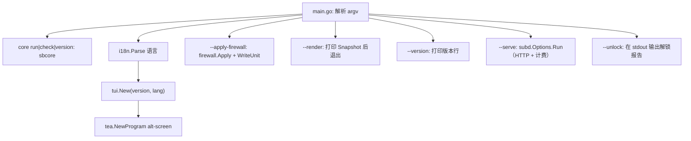

# 架构

EasySB 是仓库根目录下的一个 Go module。运行程序需要的一切都编译进单一静态二进制：sing-box 内核是模块依赖（`internal/sbcore`），证书通过 `github.com/go-acme/lego/v5` 在进程内签发。因此运行中的面板什么都不下载，既不需要内核压缩包，也不需要 `acme.sh` 或 `socat`。剩下的唯一下载是可选的 BBR 内核包（`internal/bbr`）；面板自身的更新（`internal/update`）只通过 HTTPS 读取已发布的 `VERSION` 来判断是否有新版本，真正的升级交给 apt。

## 仓库布局

```text
.
├── main.go                         # 入口、flag、版本解析、`core run`、`--tool`
├── VERSION                         # 程序版本，唯一事实来源
├── release/TAGS                    # 构建标签集合的唯一定义
├── install.sh                      # 安装脚本：一条命令配好软件源并安装
├── Makefile                        # 构建 / 测试 / 打包入口（见 `make help`）
├── packaging/                      # 包生命周期脚本（deb/）与 apt 源构建器（repo/）
├── go.mod / go.sum                 # module github.com/EasySBTeam/EasySB，Go 1.27.1
├── templates/                      # 可读的 JSONC 样例与订阅模板
│   ├── anytls/
│   ├── hysteria2/
│   ├── tuic/
│   ├── vmess-websocket-tls/
│   ├── vless-vision-reality/
│   └── config/
│       ├── tun-fakeip.json          # TUN + FakeIP 的 sing-box 订阅模板
│       └── mihomo.yaml              # mihomo / Clash Meta 订阅模板
├── internal/                       # 全部实现包
├── assets/                         # README 横幅图
├── docs/                           # 工程文档
├── AGENTS.md                       # agent 入口
├── README.md                       # 英文（默认）
└── README_ZH.md                    # 中文
```

`templates/` 是文档与参考资料。运行时真正使用的订阅模板通过 `//go:embed` 从 `internal/subscribe/tun-fakeip.json` 与 `internal/subscribe/mihomo.yaml` 嵌入；修改时务必保持每一对文件同步。

## 运行时数据

| 路径 | 归属 | 用途 |
| :--- | :--- | :--- |
| `/etc/sing-box/easysb.conf` | `internal/state` | 持久化的节点状态，兼容旧版的 KV |
| `/etc/sing-box/config.json` | `internal/config` | 渲染出的服务端配置；携带与账号库相同的凭据，所以同样是 `0600` |
| `/etc/sing-box/cert/` | `internal/cert` | 自签名占位证书对，在签发真实证书前使用 |
| `/etc/sing-box/easysb-users.json` | `internal/user` | 账号：凭据、配额、有效期与计数器（`0600`） |
| `/etc/systemd/system/easysb.service` | `internal/service` | 订阅服务单元（`easysb --serve`） |
| `/etc/systemd/system/sing-box.service` | `internal/service` | 内核服务单元 |
| `/etc/sing-box/acme/` | `internal/cert` | ACME 状态，可用 `EASYSB_ACME_DIR` 覆盖：`account.key` 与 `account.json`（`0600`），随后每个域名一个目录，内含 `fullchain.cer`（`0644`）与 `private.key`（`0600`） |
| `/etc/sysctl.d/99-easysb-bbr.conf`、`/etc/modules-load.d/easysb-bbr.conf` | `internal/bbr` | EasySB 自己写入的 BBR 设置，因此永远不会与内核项目自己的 drop-in 冲突；sysctl 文件带有记录被替换值的注释，清除操作据此还原。已安装的内核包（`minimaxflora-bbrv3`）归 dpkg 管理，通过 apt 移除 |
| `/etc/sing-box/easysb-ui.conf` | `internal/prefs` | 界面选择（皮肤、配色、标记集、语言），`0644`，可用 `EASYSB_UI_CONF` 覆盖 |
| `/etc/systemd/system/easysb-acme.timer` | `internal/cert` | 证书续期：面板通过 lego 在进程内签发与续期，所以这个单元是唯一续期者，`--renew-certs` 会在之后重载服务。单元里写着写入它的二进制路径，所以由面板内部安装（或用 `--install-renew-timer`），而不是在主机之间拷贝 |

## 打包与 apt 软件源

一次发布被标记并命名为 `v<VERSION>`，每个架构携带一个 `.deb`。软件包与 apt 源由同一批 `dist/` 二进制构建，所以没有东西被编译两次，架构列表也没有重复。`.deb` 来自同一棵暂存树（`make pkg-stage`），由一个架构的作业通过 `make packages-asset` 端到端驱动：

| 部件 | 来源 |
| :--- | :--- |
| 二进制与快捷指令 | `dist/easysb-linux-<asset>` → `/usr/bin/easysb`，并软链为 `/usr/bin/sb`；`pkg-stage` 在进入暂存树时用 UPX 压缩 |
| `sing-box.service` | `easysb --print-unit node --unit-exec /usr/bin/easysb`，与面板运行时写入的是同一个 `internal/service.UnitBody` |
| `easysb.service` | `easysb --print-unit sub --unit-exec /usr/bin/easysb`，与 `internal/subd.UnitBody` 相同 |
| 包架构 | `Makefile` 中的 `DEBARCH_MAP`，以资产名（`amd64`、`arm64`）为键，一张表同时驱动打包与布局 |
| apt 源 | `make repo` 运行 `packaging/repo/index.sh`：输出一层扁平目录，含 `Packages` / `Packages.gz`、签名的 `Release` / `InRelease` / `Release.gpg`、公钥 `easysb-archive-keyring.asc`、`install.sh` 与各架构的 `.deb`。发布作业把这些文件作为资产附到 release，release 即软件源根 |

`dist/easysb-linux-<asset>` 只是中间产物：`pkg-stage` 把它拷入暂存树，`deb-asset` 在那里构建 `.deb`，发布与软件源都不会单独发布裸二进制。

软件包携带单元但不会启用或启动它们：全新主机没有节点配置，所以面板在用户配置好之后才启用并启动服务。由于打包的单元位于 `/usr/lib/systemd/system`，而面板把自己的单元写到 `/etc/systemd/system`，面板的那份在其存在期间优先生效，打包的那份作为回退，二者不会争抢同一路径。

apt 需要的固定地址就是 GitHub Release 本身：发布工作流构建 `dist/repo`（一棵扁平 apt 仓库），用发布密钥签名，再把每个文件附到 release，因此一条命令的 `install.sh` 可以写入永不变化的软件源条目（`https://github.com/EasySBTeam/EasySB/releases/latest/download`）。那一层目录带有 `install.sh`、公钥 `easysb-archive-keyring.asc`、`Packages`/`Packages.gz`、签名的 `Release`/`InRelease`/`Release.gpg` 与各架构的 `.deb`；一份包服务所有发行版，因此没有 `dists/` 分层，也没有 `pool/`。

## 包职责

| 包 | 职责 |
| :--- | :--- |
| `internal/tui` | bubbletea model、全屏仪表盘、菜单树、表单、面板、进度 |
| `internal/state` | 读写 `easysb.conf`；协议键、默认端口、默认参数 |
| `internal/config` | 由状态渲染 sing-box 服务端配置 |
| `internal/deploy` | 面板与订阅服务共用的部署路径：渲染、写入 `config.json`（`0600`）、让所携带的内核接受它、重启内核、记录哪些账号在线 |
| `internal/sbcore` | 编译进来的内核：`Run`（节点，`easysb core run`）、`Check`（由真实内核接受配置）、`Version`，以及作为带标签文件对的 `with_v2ray_api` 能力 |
| `internal/download` | 仅存的 HTTP 到文件路径：面板自身发布与 BBR 内核包，带进度读数 |
| `internal/cert` | 通过 lego 在进程内做 ACME（HTTP-01 standalone）：账号、签发/续期/移除证书、到期判断、续期定时器单元、自签名回退 |
| `internal/prefs` | 记住并重新应用界面选择：皮肤、配色、标记集、语言 |
| `internal/firewall` | Hysteria2 端口跳跃 DNAT 规则与开机恢复单元 |
| `internal/bbr` | BBR：读取运行内核的拥塞控制状态，通过 sysctl drop-in 启用（记录被替换值以便清除时撤销），并安装 Linux-BBR-v3 发布的预编译 BBRv3 内核（release/tag 发现、镜像回退、dpkg） |
| `internal/user` | 账号模型与存储：逐协议凭据、配额/到期判断、订阅令牌 |
| `internal/subd` | 订阅 HTTP 服务：TLS、User-Agent 协商、响应头、计费循环 |
| `internal/stats` | 内核 `StatsService` 的 gRPC 客户端，用量计费与配额执行 |
| `internal/subscribe` | 订阅 URL、逐协议分享链接、二维码载荷，以及单个账号的 sing-box JSON、mihomo YAML 与 v2rayN base64 文档 |
| `internal/secret` | 随机 UUID / 密码 / Reality 密钥对生成 |
| `internal/service` | systemd 检测、安装、启停、状态 |
| `internal/sysinfo` | 仪表盘用的主机/设备/内核/服务状态：本地 IPv4/IPv6、CPU 核数、负载、内存、交换、磁盘与运行时长 |
| `internal/netutil` | 小型网络辅助（公网 IPv4 优先的 IP 探测、主机名解析） |
| `internal/uninstall` | 移除部署，同时保留已签发的证书 |
| `internal/update` | 检查已发布的 `VERSION`，通过 apt 升级 `easysb` 包，然后请求重启 |
| `internal/toolbox` | 每个工具箱条目返回什么、面板交给它什么：一个 `Result`，形如表格；一个 `Options`，携带所有外部依赖 |
| `internal/toolbox/tools` | 工具箱注册表：菜单、看板与 `--tool` 读取的同一份清单 |
| `internal/toolbox/backtrace` | 三网回程：ICMP 路径探测与承载回程流量的运营商 |
| `internal/toolbox/ipquality` | IP 质量：若干免密钥数据库、IP 类型、DNS 黑名单 |
| `internal/toolbox/portcheck` | 邮件端口：对公网地址的邮件端口探测、PTR 与 FCrDNS |
| `internal/toolbox/bench` | CPU、内存与磁盘负载，用标准库测量 |
| `internal/toolbox/speed` | speedtest.net 运行：就近服务器，三网测速只用中国运营商服务器 |
| `internal/toolbox/hw` | 从 /proc、/sys 与 df 读取的系统与磁盘信息 |
| `internal/unlock` | 解锁探测：这个 IP 能否使用 ChatGPT、Netflix、Disney+、YouTube Premium、Prime Video、TikTok、Spotify、Reddit、Steam、巴哈姆特動畫瘋 与 Bilibili 各区，每个结论来自一次小型 HTTP 请求，从不做乐观猜测 |
| `internal/i18n` | `C` / `E` 双语字符串表 |
| `internal/icons` | 单列 Unicode 符号集，`EASYSB_ICONS=ascii` 回退到 ASCII |
| `internal/theme` | 深色 / 浅色配色与边框/列布局辅助 |
| `internal/ui` | 每个界面绘制所用的零件：表格渲染器（按显示宽度分列，所以中文单元格保持对齐）与共享套件 |

## 固定版式

每个页面都绘制相同的两个框，处在相同的行、相同的大小。这些行来自主页面，也就是操作者最先看到的页面：

```text
┌ 看板 ┐   栏目的摘要，或主页面上的欢迎看板
          一个空行
┌ 菜单 ┐   操作者当前所在页面的条目
· 说明    悬停条目的描述
┌ 提示 ┐   在本页可用的按键
```

`internal/tui/layout.go` 拥有这些槽位。`layoutFor` 按一个固定顺序分配它们，每个页面都使用相同结果，所以边框在光标下永远不会跳动：

- 尾部（先是悬停条目的描述，再是按键提示）最先预留，因为它属于每个页面；
- 条目框按面板一行一条列出时最高的菜单来定高——硬件组的六个工具加返回，在 100 列时是九行；
- 看板取剩余空间，最多到主页面欢迎卡自身的高度。框之间的空行在卡片丢掉一行之前让出；终端太矮时是看板收缩：它是唯一一个内容可以说「…还有 N 行未显示」而仍然有用的槽位。

看板的内容随分配给它的行数自适应，而不是反过来决定行数：欢迎卡依次丢掉引用、标语、字标本身，并保留其实时体征；其他页面的看板写进同样的行。`boxAt` 用空行填充框而不是让它缩小，所以只有四个条目的页面和九个条目的页面对齐。

按键提示上方的那一行属于主菜单，其行只带编号和名称：那里会完整解释悬停条目。它下面的每个页面把描述放在行内，所以那一行在别处是空白——但仍然占一行，因为提示固定在每个页面的同一位置。只有一个界面可滚动：完成后的报告在框内用 ↑/↓、PageUp/PageDown 与 Home/End 阅读，顶行编号显示在其下一行，因为测量结果需要完整阅读而不是数格子。

`dashboard.go` 负责条目布局：主菜单保留它一直有的两列与纯编号加名称的行，其他页面一行一条并把描述放在标签旁——这正是框后那一行会完整重复的内容，所以太宽而放不下的描述仍能读到结尾。超出每行一条的页面（账号详情页的十二项操作）回退到面板的列布局，而不是把一半内容藏进「+N」行：没人看得见的条目等于没人能到达的条目。什么都不会滚动——`clipRows` 把内容裁剪到框拥有的行数，并以一行说明省略了多少行；工具箱看板写成摘要，即已测量数量加它能显示的最新结果。

运行中的任务与完成的报告在**一个**框里跨越两个槽位——相同的行、相同的位置，所以工作开始时和结束时屏幕形状不变。目的地界面（系统界面、链接面板、表单）保留整个主体：它们的内容就是页面，会接管版面而不是在其中列条目。

## 程序流程



`core` 是唯一的子命令：`core run -c <config>` 是服务单元启动的节点，`core check` 用同一内核校验配置，`core version` 打印这个二进制携带的 sing-box 版本。

TUI 是一棵 `menu` 与 `node` 值构成的树（`internal/tui/menu.go`）。叶子携带 `actionFunc`；分支携带 `sub *menu`。动作调用领域包，并通过 app 的日志/进度通道回报。

## 部署路径

1. `internal/user` 载入账号，并为每个启用的协议生成凭据。
2. `internal/cert` 解析或签发证书。
3. `internal/config` 从节点状态、可能上线的账号与模板渲染 `/etc/sing-box/config.json`。仅当 `sbcore.StatsCapable()` 表示这个构建携带 API 时才包含 `experimental.v2ray_api` 块。
4. `internal/sbcore` 接受或拒绝渲染出的文档：真正会提供服务的同一内核构建它再关闭它，所以节点无法启动的配置永远不会到达服务。
5. `internal/service` 安装并启动 `sing-box.service` 单元，它以节点模式运行本面板（`easysb core run -c …`）。
6. 操作者在「订阅管理」中安装 `easysb.service`；`easysb --serve` 响应订阅并统计流量。

每一步成功后都会写入状态，所以部分完成的部署可以继续。

## 订阅端点

`internal/subd` 从内建服务（`easysb --serve`）提供一个端点 `/sub/<token>`；`internal/nginx` 已移除。令牌属于某个账号，响应格式由 User-Agent 协商，所以客户端无需在三个地址之间选择。

| 路径 | 正文 | Content-Type | 客户端 |
| :--- | :--- | :--- | :--- |
| `/sub/<token>` | sing-box JSON 配置 | `application/json` | sing-box（SFM / SFA / SFI） |
| `/sub/<token>` | mihomo YAML 配置 | `text/yaml` | mihomo / Clash Meta、luci-app-nikki |
| `/sub/<token>` | Base64 分享链接文档 | `text/plain` | v2rayN、passwall、passwall2、homeproxy |

Base64 文档是通用格式：上面每个客户端要么直接读取 Base64 分享链接，要么先把文档 base64 解码。`luci-app-nikki` 运行 mihomo 内核，并按顶层 `proxies` 键校验订阅，所以它消费 mihomo 配置。分享链接保留规范的带连字符 UUID，因为 homeproxy 会通过其 LuCI `uuid` 校验拒绝 32 字符的无连字符形式。

服务还会在 `Subscription-Userinfo` 中报告用量，客户端无需解析配置就能显示「已用尽」或「已过期」；对于被禁用、已过期或超额的账号，它用 `403` 加纯文本原因拒绝，而不是提供一个没有任何节点的配置。

`subscribe.ClientLink` 构建二维码载荷。sing-box 把 URL 包进它的深层链接（`sing-box://import-remote-profile?url=`），因为这是它扫描器所期望的。mihomo / Clash Meta 与 v2rayN 得到的是纯 URL：Clash 系扫描器把扫描文本直接交给其 HTTP 客户端，所以 `clash://install-config?url=` 深层链接会抓取失败。

## 相关页面

- [设计](/dev/design)
- [约定](/dev/conventions)
- [踩坑](/dev/pitfalls)
- [构建与测试](/dev/build)
- [内核构建](/config/core-builds)
- [运行时路径](/config/paths)
