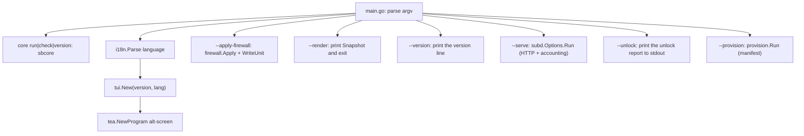

# Architecture

EasySB is one Go module at the repository root. Everything the program needs to run is compiled into a single static binary: the sing-box core is a module dependency (`internal/sbcore`), and certificates are issued in-process through `github.com/go-acme/lego/v5`. The running panel downloads nothing, needing neither a core tarball nor `acme.sh` or `socat`. The only download left is the optional BBR kernel package (`internal/bbr`); the panel's own update check (`internal/update`) reads the published `VERSION` over HTTPS only to decide whether a newer version exists, and leaves the actual upgrade to apt.

## Repository layout

```text
.
├── main.go                         # Entry point, flags, version resolution, `core run`, `--tool`
├── VERSION                         # Program version, the single source of truth
├── release/TAGS                    # The only definition of the build tag set
├── install.sh                      # Installer: one command writes the source and installs
├── Makefile                        # Build / test / package entry point (see `make help`)
├── packaging/                      # Package lifecycle scripts (deb/) and apt repo builder (repo/)
├── go.mod / go.sum                 # module github.com/EasySBTeam/EasySB, Go 1.27.1
├── templates/                      # Readable JSONC samples and subscription templates
│   ├── anytls/
│   ├── hysteria2/
│   ├── tuic/
│   ├── vmess-websocket-tls/
│   ├── vless-vision-reality/
│   └── config/
│       ├── tun-fakeip.json          # sing-box subscription template for TUN + FakeIP
│       └── mihomo.yaml              # mihomo / Clash Meta subscription template
├── internal/                       # Every implementation package
├── assets/                         # README banner image
├── docs/                           # Engineering docs
├── AGENTS.md                       # Agent entry point
├── README.md                       # English (default)
└── README_ZH.md                    # Chinese
```

`templates/` is documentation and reference material. The subscription templates actually used at runtime are embedded with `//go:embed` from `internal/subscribe/tun-fakeip.json` and `internal/subscribe/mihomo.yaml`; keep each pair in sync when editing.

## Runtime data

| Path | Owner | Purpose |
| :--- | :--- | :--- |
| `/etc/sing-box/easysb.conf` | `internal/state` | Persisted node state, compatible with the legacy KV |
| `/etc/sing-box/config.json` | `internal/config` | Rendered server configuration; carries the same credentials as the account store, so it is `0600` too |
| `/etc/sing-box/cert/` | `internal/cert` | Self-signed placeholder certificate pair, used before a real certificate is issued |
| `/etc/sing-box/easysb-users.json` | `internal/user` | Accounts: credentials, quota, expiry and counters (`0600`) |
| `/etc/systemd/system/easysb.service` | `internal/service` | Subscription service unit (`easysb --serve`) |
| `/etc/systemd/system/sing-box.service` | `internal/service` | Core service unit |
| `/etc/sing-box/acme/` | `internal/cert` | ACME state, overridable with `EASYSB_ACME_DIR`: `account.key` and `account.json` (`0600`), then one directory per domain containing `fullchain.cer` (`0644`) and `private.key` (`0600`) |
| `/etc/sysctl.d/99-easysb-bbr.conf`, `/etc/modules-load.d/easysb-bbr.conf` | `internal/bbr` | BBR settings written by EasySB, so they never conflict with the kernel project's own drop-ins; the sysctl file carries comments recording replaced values, which the clear operation uses to restore them. Installed kernel packages (`minimaxflora-bbrv3`) are managed by dpkg and removed through apt |
| `/etc/sing-box/easysb-ui.conf` | `internal/prefs` | Interface choices (skin, palette, marker set, language), `0644`, overridable with `EASYSB_UI_CONF` |
| `/etc/systemd/system/easysb-acme.timer` | `internal/cert` | Certificate renewal: the panel issues and renews in-process through lego, so this unit is the only renewer and `--renew-certs` reloads services afterwards. The unit names the binary path that wrote it, so it is installed from inside the panel (or with `--install-renew-timer`) rather than copied between hosts |

## Packaging and the apt source

One release is tagged and named `v<VERSION>` and carries one `.deb` per architecture. The package and the apt source are built from the same `dist/` binaries, so nothing is compiled twice and no architecture list is duplicated. The `.deb` comes from one staged tree (`make pkg-stage`), driven end-to-end for one architecture by `make packages-asset`:

| Part | Source |
| :--- | :--- |
| Binary and shortcut | `dist/easysb-linux-<asset>` → `/usr/bin/easysb`, symlinked as `/usr/bin/sb`; `pkg-stage` UPX-compresses it on the way into the staged tree |
| `sing-box.service` | `easysb --print-unit node --unit-exec /usr/bin/easysb`, the same `internal/service.UnitBody` the panel writes at runtime |
| `easysb.service` | `easysb --print-unit sub --unit-exec /usr/bin/easysb`, the same as `internal/subd.UnitBody` |
| Package architecture | `DEBARCH_MAP` in the `Makefile`, keyed by asset name (`amd64`, `arm64`), one table driving both packaging and layout |
| apt source | `make repo` runs `packaging/repo/index.sh`: it writes one flat directory with `Packages` / `Packages.gz`, a signed `Release` / `InRelease` / `Release.gpg`, the public key `easysb-archive-keyring.asc`, `install.sh` and one `.deb` per architecture. The release job attaches those files to the release, which serves as the source root |

`dist/easysb-linux-<asset>` is only an intermediate: `pkg-stage` copies it into the staged tree, `deb-asset` builds the `.deb` there, and neither the release nor the source publishes a bare binary.

The package carries the units but does not enable or start them: a fresh host has no node config, so the panel enables and starts services only after the user configures them. Because the packaged units live in `/usr/lib/systemd/system` while the panel writes its own into `/etc/systemd/system`, the panel's copy takes precedence while it exists and the packaged copy is a fallback; the two never fight over the same path.

The fixed address apt needs is the GitHub Release itself: the release workflow builds `dist/repo` (a flat apt repository), signs it with the release key, and attaches every file to the release, so the one-command `install.sh` can write a source entry (`https://github.com/EasySBTeam/EasySB/releases/latest/download`) that never changes. That one directory carries `install.sh`, the public key `easysb-archive-keyring.asc`, `Packages`/`Packages.gz`, the signed `Release`/`InRelease`/`Release.gpg` and one `.deb` per architecture; a single package serves every distribution, so there is no `dists/` split and no `pool/`.

## Package responsibilities

| Package | Responsibility |
| :--- | :--- |
| `internal/tui` | bubbletea model, full-screen dashboard, menu tree, forms, panels, progress |
| `internal/state` | Read and write `easysb.conf`; protocol keys, default ports, default parameters |
| `internal/config` | Render the sing-box server configuration from state |
| `internal/deploy` | Deploy path shared by the panel and the subscription service: render, write `config.json` (`0600`), have the carried core accept it, restart the core, record which accounts are live |
| `internal/provision` | Headless deployment: drives the nodes, certificate, accounts and subscription of a whole deployment from one JSON manifest, the body of `--provision` |
| `internal/sbcore` | The compiled-in core: `Run` (node, `easysb core run`), `Check` (accept a config with the real core), `Version`, and the `with_v2ray_api` capability as a tagged file pair |
| `internal/download` | The only HTTP-to-file path left: the panel's own release and the BBR kernel package, with progress readings |
| `internal/cert` | In-process ACME through lego (HTTP-01 standalone): accounts, issue / renew / remove certificates, expiry checks, renewal timer unit, self-signed fallback |
| `internal/prefs` | Remember and reapply interface choices: skin, palette, marker set, language |
| `internal/firewall` | Hysteria2 port-hopping DNAT rules and the boot-time restore unit |
| `internal/bbr` | BBR: read the running kernel's congestion control, enable it through sysctl drop-ins (recording replaced values so clearing can restore them), and install the prebuilt BBRv3 kernel published by Linux-BBR-v3 (release / tag discovery, mirror fallback, dpkg) |
| `internal/user` | Account model and store: per-protocol credentials, quota / expiry decisions, subscription token |
| `internal/subd` | Subscription HTTP service: TLS, User-Agent negotiation, response headers, accounting loop |
| `internal/stats` | gRPC client for the core's `StatsService`, usage accounting and quota enforcement |
| `internal/subscribe` | Subscription URL, per-protocol share links, QR payloads, and the sing-box JSON, mihomo YAML and v2rayN base64 document for one account |
| `internal/secret` | Random UUID / password / Reality key pair generation |
| `internal/service` | systemd detection, install, start / stop, status |
| `internal/sysinfo` | Host / device / kernel / service status for the dashboard: local IPv4 / IPv6, CPU count, load, memory, swap, disk and uptime |
| `internal/netutil` | Small network helpers (public-IPv4-first IP detection, hostname resolution) |
| `internal/uninstall` | Remove a deployment while keeping issued certificates |
| `internal/update` | Check the published `VERSION`, upgrade the `easysb` package through apt, then request a restart |
| `internal/toolbox` | What each toolbox item returns and what the panel hands it: a `Result` shaped like a table, and an `Options` carrying every external dependency |
| `internal/toolbox/tools` | Toolbox registry: the one list read by the menu, the board and `--tool` |
| `internal/toolbox/backtrace` | Three-network backtrace: ICMP path probing and the carriers carrying the return traffic |
| `internal/toolbox/ipquality` | IP quality: several keyless databases, IP type, DNS blocklists |
| `internal/toolbox/portcheck` | Mail ports: mail-port probing of the public address, PTR and FCrDNS |
| `internal/toolbox/bench` | CPU, memory and disk workloads, measured with the standard library |
| `internal/toolbox/speed` | speedtest.net runs: nearby server, and three-network tests limited to Chinese carrier servers |
| `internal/toolbox/hw` | System and disk info read from /proc, /sys and df |
| `internal/unlock` | Unlock probes: whether this IP can use ChatGPT, Netflix, Disney+, YouTube Premium, Prime Video, TikTok, Spotify, Reddit, Steam, Bahamut Anime and each Bilibili region, with every verdict coming from a small HTTP request and never an optimistic guess |
| `internal/i18n` | `C` / `E` bilingual string tables |
| `internal/icons` | A single-column Unicode symbol set, with `EASYSB_ICONS=ascii` falling back to ASCII |
| `internal/theme` | Dark / light palettes and border / column layout helpers |
| `internal/ui` | Parts used by every screen: the table renderer (columns sized by display width, so Chinese cells stay aligned) and shared suites |

## Fixed layout

Every screen draws the same two boxes, at the same lines and the same size. These lines come from the main screen, the one the operator sees first:

```text
┌ Board ┐   A summary of the section, or the welcome board on the main screen
           one blank line
┌ Menu ┐    The items of the page the operator is on
· Note      The description of the hovered item
┌ Hints ┐   The keys available on this page
```

`internal/tui/layout.go` owns these slots. `layoutFor` assigns them in a fixed order and every screen uses the same result, so borders never jump under the cursor:

- The tail (first the hovered item's description, then the key hints) is reserved first, because it belongs to every screen;
- The item box is sized by the tallest menu when the panel lists one per line; the hardware group's six tools plus return is nine lines at 100 columns;
- The board takes the remaining space, up to the main screen welcome card's own height. The blank line between boxes yields before the card loses a line; on a too-short terminal the board shrinks: it is the only slot whose content can say "… N more lines not shown" and still be useful.

The board's content adapts to the lines allocated to it, rather than deciding the line count: the welcome card drops the quote, the tagline and the wordmark itself in turn, keeping its live vitals; other screens write into the same lines. `boxAt` pads boxes with blank lines instead of shrinking them, so a four-item screen and a nine-item screen align.

The line above the key hints belongs to the main menu, whose lines carry only a number and a name: the hovered item is explained in full there. Every screen below it puts the description inline, so that line is blank elsewhere, but still occupies a line, because the hints are fixed at the same position on every screen. Only one screen scrolls: a completed report is read inside the box with ↑/↓, PageUp/PageDown and Home/End, and the top-line number is shown on the line below it, because measurements need to be read in full rather than counted out on a grid.

`dashboard.go` handles item layout: the main menu keeps its long-standing two columns and pure number-plus-name rows, while other screens use one item per line and put the description beside the label, which is exactly what the line after the box repeats in full, so an over-wide description can still be read to the end. A screen that exceeds one item per line (the account detail screen's twelve operations) falls back to the panel's column layout rather than hiding half the content in a "+N" row: an item nobody can see is an item nobody can reach. Nothing scrolls: `clipRows` clips content to the lines the box owns and writes one line saying how many lines were omitted; the toolbox board is written as a summary, meaning the number measured plus the most recent result it can show.

Running tasks and completed reports span **one** box across both slots, the same lines at the same position, so the screen shape is unchanged from when work begins to when it ends. Destination screens (the system screen, the link panel, forms) keep the entire body: their content is the page, taking over the layout rather than listing items inside it.

## Program flow



`core` is the only subcommand: `core run -c <config>` is the node the service unit starts, `core check` validates a configuration with the same core, and `core version` prints the sing-box version this binary carries.

The TUI is a tree of `menu` and `node` values (`internal/tui/menu.go`). Leaves carry an `actionFunc`; branches carry a `sub *menu`. Actions call domain packages and report back through the app's log / progress channel.

## Deploy path

1. `internal/user` loads accounts and generates credentials for each enabled protocol.
2. `internal/cert` resolves or issues certificates.
3. `internal/config` renders `/etc/sing-box/config.json` from node state, the accounts that may be live and the templates. It includes the `experimental.v2ray_api` block only when `sbcore.StatsCapable()` says this build carries the API.
4. `internal/sbcore` accepts or rejects the rendered document: the same core build that will actually serve builds it and closes it, so a configuration the node cannot start never reaches the service.
5. `internal/service` installs and starts the `sing-box.service` unit, which runs this panel in node mode (`easysb core run -c …`).
6. The operator installs `easysb.service` in `Subscription management`; `easysb --serve` serves subscriptions and accounts traffic.

State is written after each successful step, so a partially completed deployment can continue.

## Subscription endpoint

`internal/subd` provides one endpoint `/sub/<token>` from the built-in service (`easysb --serve`); `internal/nginx` has been removed. The token belongs to an account, and the response format is negotiated from the User-Agent, so clients need not choose among three addresses.

| Path | Body | Content-Type | Client |
| :--- | :--- | :--- | :--- |
| `/sub/<token>` | sing-box JSON configuration | `application/json` | sing-box (SFM / SFA / SFI) |
| `/sub/<token>` | mihomo YAML configuration | `text/yaml` | mihomo / Clash Meta, luci-app-nikki |
| `/sub/<token>` | Base64 share-link document | `text/plain` | v2rayN, passwall, passwall2, homeproxy |

The Base64 document is the common format: each client above either reads Base64 share links directly or Base64-decodes the document first. `luci-app-nikki` runs the mihomo core and validates the subscription by a top-level `proxies` key, so it consumes the mihomo configuration. Share links keep the canonical hyphenated UUID, because homeproxy rejects the 32-character unhyphenated form through its LuCI `uuid` validation.

The service also reports usage in `Subscription-Userinfo`, so clients can display "used up" or "expired" without parsing the configuration; for disabled, expired or over-quota accounts it refuses with `403` and a plain-text reason rather than a configuration with no nodes.

`subscribe.ClientLink` builds QR payloads. sing-box wraps the URL in its deep link (`sing-box://import-remote-profile?url=`), because that is what its scanner expects. mihomo / Clash Meta and v2rayN get the plain URL: Clash-family scanners hand the scanned text straight to their HTTP client, so a `clash://install-config?url=` deep link would fail to fetch.

## Related pages

- [Design](/en/dev/design)
- [Conventions](/en/dev/conventions)
- [Pitfalls](/en/dev/pitfalls)
- [Build and Test](/en/dev/build)
- [Core Build](/en/config/core-builds)
- [Runtime Paths](/en/config/paths)
